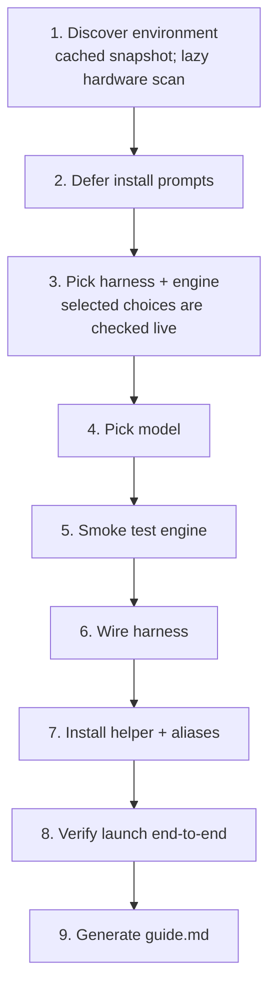

<div align="center">

<picture>
  <source media="(prefers-color-scheme: dark)" srcset="assets/logo/logo-white.svg">
  <source media="(prefers-color-scheme: light)" srcset="assets/logo/logo-black.svg">
  
</picture>

[](LICENSE)
[](https://www.python.org/downloads/)
[](https://github.com/luongnv89/claude-codex-local/actions/workflows/ci.yml)
[](https://github.com/astral-sh/ruff)
[](https://pypi.org/project/claude-codex-local/)
[](https://pypi.org/project/claude-codex-local/)
[](https://pepy.tech/project/claude-codex-local)

</div>

# Hit your limit? Need privacy? Just swap the model.

One alias. Claude Code, Codex, or [Pi](https://pi.dev/) on a local model. Skills, agents, MCP servers — all intact.

> **Quota hit mid-session?** `cc` keeps you going on a local model, no context lost.
> **Code that can't leave your machine?** Everything runs offline after model download.
> **Don't want to rewire your workflow?** Your `~/.claude`, skills, agents, and MCP servers carry over untouched.

[**Get Started →**](#quick-start) · [**Landing page →**](https://luongnv89.github.io/claude-codex-local/)

---

## Features

| Feature               | What you get                                                                                                                      |
| --------------------- | --------------------------------------------------------------------------------------------------------------------------------- |
| Ollama first-class    | `ollama launch` — no duplicated config, no custom Modelfiles                                                                      |
| Config untouched      | All skills, statusline, agents, plugins, and MCP servers carry over                                                               |
| Smart model selection | `llmfit` analyses your hardware and picks the best quantization that fits (lazy hardware scan; pass `--run-llmfit` to refresh) |
| Resume on failure     | Wizard persists progress — `--resume` picks up from the last completed step                                                       |
| Idempotent aliases    | Re-running the wizard replaces the existing alias block, never appends                                                            |
| Cloud fallback        | Run `claude` / `codex` / `pi` directly (no prefix) to switch back instantly                                                       |

---

## Quick Start

### Install from PyPI (recommended)

```bash
pip install claude-codex-local
```

Or with uv:

```bash
uv tool install claude-codex-local
```

Then run the setup wizard:

```bash
ccl
```

### One-command install (no clone required)

```bash
bash <(curl -sSL https://raw.githubusercontent.com/luongnv89/claude-codex-local/main/install.sh)
```

Or with wget:

```bash
bash <(wget -qO- https://raw.githubusercontent.com/luongnv89/claude-codex-local/main/install.sh)
```

> Use `bash <(...)`, not `curl … | bash`. The wizard is interactive and needs a real TTY — piping steals stdin.

Override defaults with env vars:

```bash
CCL_REF=v0.14.0 CCL_INSTALL_DIR=~/tools/claude-codex-local \
  bash <(curl -sSL https://raw.githubusercontent.com/luongnv89/claude-codex-local/main/install.sh)
```

### Install from a clone

```bash
git clone https://github.com/luongnv89/claude-codex-local.git
cd claude-codex-local
```

```bash
python3 -m venv .venv && source .venv/bin/activate
pip install -e .
```

```bash
ccl
```

### After setup

Reload your shell so the alias is available:

```bash
source ~/.zshrc   # or source ~/.bashrc
```

Then run:

```bash
cc        # Claude Code → local model
cx        # Codex CLI → local model
ccp       # Pi → local model
```

---

## Wizard Steps



See [`guide.example.md`](guide.example.md) for the personalized daily-use guide the wizard generates.

---

## Usage

```bash
ccl                                             # run the interactive first-run wizard
ccl setup --harness claude --engine ollama      # skip the prefs picker
ccl setup --harness pi --engine ollama          # Pi (https://pi.dev/) + local model
ccl setup --non-interactive                     # CI-friendly install
ccl setup --resume                              # resume after a failure
ccl find-model                                  # standalone model recommendation
ccl doctor                                      # wizard state + presence check
ccl run                                         # launch the configured session interactively
ccl run -p "what is 2+2?"                       # one-shot: drive CCL from another agent
ccl run --native-params -- --dangerously-skip-permissions
                                                # forward harness-native flags verbatim
ccl --version                                   # print version and exit
```

`ccl run -p "<prompt>"` runs the harness in non-interactive mode (Claude
Code's `-p`, Codex's `exec`, Pi's `--print`) so external agents and CI scripts
can drive a local model end-to-end without keystrokes. Without `-p`, behavior
matches the `cc` / `cx` / `ccp` alias and the session starts interactively.

### Forwarding harness-native flags (`--native-params`)

`ccl run --native-params -- <ARGS…>` forwards everything after `--native-params`
verbatim to the launched harness. It is a generic escape hatch for harness
options that ccl does not wrap explicitly (e.g. Claude Code's
`--dangerously-skip-permissions`). Must be the last flag on the line; use `--`
to make the boundary between ccl flags and native ones explicit. ccl does not
validate native params — the harness does.

```bash
# Claude Code: skip permission prompts (interactive)
ccl run --native-params -- --dangerously-skip-permissions

# Codex: set extra exec-time flag (one-shot)
ccl run -p "summarize this repo" --native-params -- --some-codex-flag

# Pi: forward any pi-native option
ccl run --native-params -- --some-pi-option value
```

Advanced / debug (no user binary — run as a Python module):

```bash
python -m claude_codex_local.core profile      # full hardware profile as JSON
python -m claude_codex_local.core recommend    # llmfit-only model recommendation
python -m claude_codex_local.core adapters     # list all engine adapters
python -m claude_codex_local.core engine ollama config
python -m claude_codex_local.core engine vllm benchmark --model <served-model>
```

---

## Engine Lifecycle Scripts

Engine-specific lifecycle behavior lives under `claude_codex_local/engines/`.
Each supported engine owns the same script contract:

| Action | Purpose |
|---|---|
| `install` | Installation command or manual setup instructions |
| `config` | Endpoint, key-file, and environment settings |
| `optimize` | Engine-specific tuning recommendations |
| `test` | Smoke test for the selected model or endpoint |
| `benchmark` | Lightweight timing/throughput check where safe |

Supported engine packages are `ollama`, `lmstudio`, `llamacpp`, `vllm`,
`router9` (engine name `9router`), and `openrouter`. Power users can customize
one engine by editing only that engine package. Typical callers should use the
uniform dispatcher:

```bash
python -m claude_codex_local.core engine <engine> <action> [--model <tag>] [--execute]
```

`test` and `benchmark` dry-run unless `--execute` is passed. Adding another
engine means adding a package with those five modules and `ENGINE_NAME` metadata;
the dispatcher discovers it without new core branching.

---

## Sharing Context Between Agents 

`ccl run` automatically bridges conversation context across local harnesses
so you can hand off mid-task between Claude Code, Codex, and Pi without
re-explaining what you were doing. The bridge runs in two halves:

- **Post-run capture (both paths)** — after the harness exits, CCL reads its
  native session file for the current `$PWD`
  (`~/.claude/projects/...`, `~/.codex/sessions/...`, `~/.pi/agent/sessions/...`)
  and imports the cleaned, redacted messages into
  `~/.claude-codex-local/sessions/<harness>.jsonl`.
- **Pre-run injection (one-shot only)** — when you `ccl run -p PROMPT`, the
  freshest *other* harness's transcript for `$PWD` is rendered as a
  `[prior context, agent=…]\n…\n[end prior context]` block and prepended
  to `PROMPT`. Interactive sessions don't inject — each harness has its
  own `--resume`/`--continue` and stdin is the user's TTY. The
  cc-interactive → cx-one-shot handoff is the prototypical flow.

```bash
ccl run -p "continue from where claude left off"   # auto-injects context if claude has one
ccl run --no-context -p "fresh start"              # disable bridge (also CCL_SESSION_BRIDGE=0)
ccl session list                                   # show captured per-harness JSONL files
ccl session show claude                            # print one harness's messages (JSON)
ccl session sync --from claude --to codex          # manual copy if you want to force it
ccl session truncate codex --keep 50               # keep only the last N (--keep required)
ccl session clear codex                            # delete one harness's file
```

**Scope guards** keep the bridge predictable:

- **cwd-scoped** — context only flows for the same repository. Switching
  directories starts fresh.
- **7-day staleness cap** — native sessions older than a week are ignored
  so months-old transcripts can't get silently re-injected. The injection
  banner shows the source's age (`last activity 6m ago`) so you can spot a
  stale handoff before it ships to the model.
- **Source picker** — when multiple non-self harnesses have history, the
  most recently modified file wins. Same-harness one-shot continuity
  (`cc -p "foo"` then `cc -p "bar"`) is *not* covered — use Claude Code's
  own `--resume` for that.
- **Boilerplate filter** — `AGENTS.md` / `CLAUDE.md` re-dumps, slash-command
  echoes, skill loads, tool calls, reasoning traces, and other harness
  internals are dropped on import; only user/assistant text survives.
- **Redaction** — best-effort scrub of common token shapes (OpenAI,
  Anthropic, AWS, GitHub PAT/OAuth, Slack, GitLab, Google API) on every
  import and sync. Treat the JSONL files as semi-sensitive — the scrub
  covers known patterns, not arbitrary secrets in prose.
- **Idempotent** — re-running `ccl run` against the same native file does
  not duplicate messages; a content-hash dedup key skips already-imported
  rows.

The capture path is exercised on both interactive and one-shot via the same
post-run import. The injection path is currently wired only on the one-shot
(`-p`) branch.

State directory can be overridden with `CLAUDE_CODEX_LOCAL_STATE_DIR`; the
native-home base can be overridden with `CCL_NATIVE_HOME_OVERRIDE` (useful
for tests and CI). `--keep` is **required** on `truncate` to prevent
accidental wipes; use `ccl session clear` if you want to remove the file
entirely.

---

## Prerequisites

- macOS or Linux with zsh or bash
- Python 3.10+
- At least one harness: [Claude Code](https://claude.ai/code), [Codex CLI](https://github.com/openai/codex), or [Pi](https://pi.dev/) (`npm install -g @earendil-works/pi-coding-agent`) — Pi is the model-agnostic terminal coding harness whose tagline is “There are many agent harnesses, but this one is yours.”
- At least one engine: [Ollama](https://ollama.com) (recommended), [LM Studio](https://lmstudio.ai), [vLLM](https://github.com/vllm-project/vllm), llama.cpp, [9router](https://github.com/decolua/9router) (local cloud-routing proxy), or [OpenRouter](https://openrouter.ai) (hosted SaaS)
- [`llmfit`](https://github.com/luongnv89/llmfit) on `PATH` (optional — for automatic model selection)

---

## Proven Paths

| Harness     | Engine    | Model                  | Status                                                                  |
| ----------- | --------- | ---------------------- | ----------------------------------------------------------------------- |
| Claude Code | Ollama    | `gemma4:26b`           | Verified end-to-end                                                     |
| Codex CLI   | Ollama    | `gemma4:26b`           | Verified                                                                |
| Pi          | Ollama    | any local tag          | Supported via isolated Pi `models.json` and `ccp` alias                 |
| Claude Code | LM Studio | Qwen3 family           | Blocked — `400 thinking.type`; wizard warns and recommends alternatives |
| Any         | llama.cpp | any                    | Inline-env code path exists, no live proof yet                          |
| Any         | vLLM      | any                    | New in 0.8.0 — adapter shipped with tests                               |
| Claude Code | 9router   | `kr/claude-sonnet-4.5` | New in 0.9.0 — cloud-routed via `cc9` alias; existing `cc` is untouched |
| Codex CLI   | 9router   | `kr/claude-sonnet-4.5` | New in 0.9.0 — cloud-routed via `cx9` alias; existing `cx` is untouched |
| Pi          | 9router   | `kr/claude-sonnet-4.5` | Cloud-routed via `cp9`; existing `ccp` is untouched                     |
| Claude Code | OpenRouter | `anthropic/claude-sonnet-4.6` | Hosted SaaS via `cco` alias; existing `cc` is untouched (#83)           |
| Codex CLI   | OpenRouter | `anthropic/claude-sonnet-4.6` | Hosted SaaS via `cxo` alias; existing `cx` is untouched (#83)           |
| Pi          | OpenRouter | `anthropic/claude-sonnet-4.6` | Hosted SaaS via `cpo`; existing `ccp` is untouched (#83)                |

---

## Remote engine endpoints

`ccl` can consume Ollama, llama.cpp, and vLLM servers running on another
machine. The wizard probes the endpoint over HTTP and does **not** require the
remote engine binary to be installed locally.

### Interactive flow (primary)

When you run `ccl setup` and pick `ollama`, `llamacpp`, or `vllm` as your
engine, step 3 follows up with:

1. **Local or remote?** — prompt: *Run `<engine>` locally, or use a remote
   endpoint?* Default is **Local**. Pick **Remote** to point at another host.
2. **Base URL** — prompt: *Remote `<engine>` base URL (scheme + host + port,
   no path):* The wizard validates the input must be a bare base URL. Paths
   (e.g. `http://gpu-box.local:8001/v1`), queries, and fragments are rejected;
   the engine probes add the correct suffix per engine (`/api/tags` for Ollama,
   `/health` and `/v1/models` for llama.cpp, `/v1/models` for vLLM).
3. **API key** — for `llamacpp` and `vllm` only, a masked password prompt:
   *`<engine>` API key (leave empty for no auth):*. Ollama does not prompt.
4. **Persist to shell rc?** — prompt: *Also persist these env vars to your
   shell rc?* Default **No**. Pick Yes to write a fenced
   `# >>> claude-codex-local:remote:<engine> >>>` block into `~/.zshrc` /
   `~/.bashrc` so future shells inherit the same endpoint.

**Selecting Remote skips the local-binary install step** — the wizard re-probes
the URL you just provided and proceeds to model selection without offering to
install Ollama / llama.cpp / vLLM on the local machine.

Cancel any prompt with `Ctrl-C` / `Esc` to fall back to the local-install path.

### Non-interactive / CI

Set the env vars **before** running `ccl setup` (or pass `--non-interactive`).
The wizard picks them up via `core.py` and treats the engine as remote without
asking:

```bash
# Ollama native API and OpenAI-compatible /v1 endpoint
export OLLAMA_HOST=http://gpu-box.local:11434

# llama.cpp server (OpenAI-compatible API under /v1)
export LLAMACPP_BASE_URL=http://gpu-box.local:8001
# Optional if your reverse proxy / server requires bearer auth:
export LLAMACPP_API_KEY=...

# vLLM OpenAI-compatible server
export VLLM_BASE_URL=http://gpu-box.local:8000
export VLLM_API_KEY=...   # optional; vLLM only checks this if configured
```

Each URL must be the **base** of the engine host — scheme, host, and port only.
Do **not** append `/v1`, `/api`, or any other path. A trailing path silently
double-suffixes to a 404; the wizard warns and strips it, but the right input
is the bare host.

Local and remote engines can coexist: unset the relevant env var (or remove
the fenced rc block) to go back to the localhost default, or choose a different
engine in the wizard.

---

## 9router quick-start

[9router](https://github.com/decolua/9router) is a local proxy that exposes an OpenAI-compatible API on `http://localhost:20128/v1` and routes calls to cloud models such as `kr/claude-sonnet-4.5`. Picking 9router as the engine adds a **new** `cc9` (Claude), `cx9` (Codex), or `cp9` (Pi) alias and leaves your existing `cc` / `cx` / `ccp` aliases untouched.

### Installing and running 9router

**Step 1: Install 9router**

```bash
# Using npm (recommended)
npm install -g 9router

# Or using yarn
yarn global add 9router

# Or using pnpm
pnpm add -g 9router
```

**Step 2: Get your API key**

1. Visit the [9router dashboard](https://9router.com/dashboard) and sign up or log in
2. Navigate to API Keys section
3. Create a new API key and copy it

**Step 3: Start the 9router service**

```bash
# Start 9router with your API key
9router start --api-key YOUR_API_KEY_HERE

# Or set it as an environment variable
export ROUTER9_API_KEY=YOUR_API_KEY_HERE
9router start

# The service will start on http://localhost:20128
```

**Step 4: Verify 9router is running**

```bash
# Check if the service is responding
curl http://localhost:20128/v1/models

# You should see a list of available models
```

**Step 5: Configure CCL to use 9router**

```bash
# Interactive setup (wizard will prompt for API key, then list models from /v1/models)
ccl setup --engine 9router

# Non-interactive (CI / scripted):
CCL_9ROUTER_API_KEY=<paste-here> CCL_9ROUTER_MODEL=kr/claude-sonnet-4.5 \
  ccl setup --engine 9router --harness claude --non-interactive
```

### How the wizard configures 9router

The wizard:

1. Asks for the 9router API key and writes it to `~/.claude-codex-local/9router-api-key` with `chmod 0600`. The helper script reads this file at exec time via `$(cat …)` — the key is never embedded in the script body or wizard state file.
2. Fetches available models via `GET /v1/models` and shows them as a selectable list. If the endpoint is unreachable or returns no models, the wizard falls back to manual model-name entry.
3. Verifies reachability via `GET /v1/models` only. **It deliberately does not call `/chat/completions`** during smoke-test or verify, because 9router routes to paid cloud models. The verification record is `{"ok": true, "via": "9router-models-endpoint", "skipped_chat": true}`.
4. Installs `cc9` (or `cx9`) into your shell rc as a new fenced block (`# >>> claude-codex-local:claude9 >>>`), leaving any existing `cc` / `cx` block alone.

**Tip:** `cc9` and `cc` can coexist on the same machine — pick `cc9` when you want to burn cloud quota for a tough prompt, and `cc` (Ollama / LM Studio / llama.cpp) for everyday work.

### Claude Code → 9router env vars

| Env var                                    | 9router                                                       |
| ------------------------------------------ | ------------------------------------------------------------- |
| `ANTHROPIC_BASE_URL`                       | `http://localhost:20128/v1`                                   |
| `ANTHROPIC_AUTH_TOKEN`                     | `$(cat ~/.claude-codex-local/9router-api-key)` (read at exec) |
| `ANTHROPIC_API_KEY`                        | `$(cat ~/.claude-codex-local/9router-api-key)` (read at exec) |
| `ANTHROPIC_CUSTOM_MODEL_OPTION`            | `<tag>` (e.g. `kr/claude-sonnet-4.5`)                         |
| `ANTHROPIC_CUSTOM_MODEL_OPTION_NAME`       | `9router <tag>`                                               |
| `CLAUDE_CODE_ATTRIBUTION_HEADER`           | `"0"`                                                         |
| `CLAUDE_CODE_DISABLE_NONESSENTIAL_TRAFFIC` | `"1"`                                                         |

For Codex: `OPENAI_BASE_URL=http://localhost:20128/v1`, `OPENAI_API_KEY=$(cat …)`.

---

## OpenRouter quick-start

[OpenRouter](https://openrouter.ai) is a hosted-SaaS cloud-routing service that exposes an OpenAI-compatible API at `https://openrouter.ai/api/v1` and forwards calls to dozens of cloud models (Claude, GPT-4o, Llama 3.1, Mistral, and many more). Unlike 9router, there is **no daemon to install** — only an API key. Picking OpenRouter as the engine adds a **new** `cco` (Claude), `cxo` (Codex), or `cpo` (Pi) alias and leaves your existing `cc` / `cx` / `ccp` aliases untouched.

### Setting up OpenRouter

**Step 1: Get your API key**

1. Visit [openrouter.ai/keys](https://openrouter.ai/keys) and sign up or log in
2. Create a new API key and copy it
3. Optionally fund your account or set a per-key spending limit

**Step 2: Configure CCL to use OpenRouter**

```bash
# Interactive setup (wizard will prompt for API key)
ccl setup --engine openrouter

# Non-interactive (CI / scripted):
CCL_OPENROUTER_API_KEY=<paste-here> CCL_OPENROUTER_MODEL=anthropic/claude-sonnet-4.6 \
  ccl setup --engine openrouter --harness claude --non-interactive
```

### How the wizard configures OpenRouter

The wizard:

1. Asks for the OpenRouter API key and writes it to `~/.claude-codex-local/openrouter-api-key` with `chmod 0600`. The helper script reads this file at exec time via `$(cat …)` — the key is never embedded in the script body or wizard state file.
2. Verifies reachability via `GET /models` only. **It deliberately does not call `/chat/completions`** during smoke-test or verify, because OpenRouter routes to paid cloud models. The verification record is `{"ok": true, "via": "openrouter-models-endpoint", "skipped_chat": true}`.
3. Installs `cco` (or `cxo` / `cpo`) into your shell rc as a new fenced block (`# >>> claude-codex-local:claudeo >>>`), leaving any existing `cc` / `cx` / `ccp` block alone.

**Tip:** `cco` and `cc` can coexist on the same machine — pick `cco` when you want a hosted model, and `cc` (Ollama / LM Studio / llama.cpp) for everyday local work.

### Claude Code → OpenRouter env vars

| Env var                                    | OpenRouter                                                          |
| ------------------------------------------ | ------------------------------------------------------------------- |
| `ANTHROPIC_BASE_URL`                       | `https://openrouter.ai/api/v1`                                      |
| `ANTHROPIC_AUTH_TOKEN`                     | `$(cat ~/.claude-codex-local/openrouter-api-key)` (read at exec)    |
| `ANTHROPIC_API_KEY`                        | `$(cat ~/.claude-codex-local/openrouter-api-key)` (read at exec)    |
| `ANTHROPIC_CUSTOM_MODEL_OPTION`            | `<tag>` (e.g. `anthropic/claude-sonnet-4.6`)                        |
| `ANTHROPIC_CUSTOM_MODEL_OPTION_NAME`       | `OpenRouter <tag>`                                                  |
| `HTTP_REFERER`                             | `https://github.com/luongnv89/ccl` (OpenRouter attribution header)  |
| `X_TITLE`                                  | `claude-codex-local` (OpenRouter attribution header)                |
| `CLAUDE_CODE_ATTRIBUTION_HEADER`           | `"0"`                                                               |
| `CLAUDE_CODE_DISABLE_NONESSENTIAL_TRAFFIC` | `"1"`                                                               |

For Codex: `OPENAI_BASE_URL=https://openrouter.ai/api/v1`, `OPENAI_API_KEY=$(cat …)`.

Override the base URL via `CCL_OPENROUTER_BASE_URL` and the model via `CCL_OPENROUTER_MODEL`.

---

## Rollback

```bash
# Remove the fenced block from ~/.zshrc (between the marker lines)
rm -rf .claude-codex-local
```

Each fence block (`claude` / `codex` / `claude9` / `codex9` / `claudeo` / `codexo`) is independent — you can remove just one without touching the others. Your `~/.claude` and `~/.codex` are unchanged.

---

<details>
<summary>Architecture details</summary>

### Three layers

1. **Machine profile + model recommendation** (`claude_codex_local/core.py`) — dumps a JSON snapshot of installed harnesses/engines/llmfit/disk, runs `llmfit` for ranked model recommendations, and provides a `doctor` command for pretty-printing wizard state.

2. **Interactive wizard** (`claude_codex_local/wizard.py`) — 9 steps from discovery to ready-to-use daily alias. Persists progress in `.claude-codex-local/wizard-state.json` so `--resume` picks up after a failure.

3. **Helper scripts + shell aliases** — `.claude-codex-local/bin/cc` (or `cx`) is a short bash wrapper. For Ollama it runs `ollama launch claude|codex --model <tag>`. For LM Studio / llama.cpp it sets inline env vars and execs the real harness. A fenced block in `~/.zshrc` / `~/.bashrc` declares the aliases.

### Why `ollama launch`

`ollama launch claude --model <tag>` is an official Ollama subcommand that sets the right env vars internally and execs the user's real `claude` binary against the local daemon — using `~/.claude` as-is.

This means:

- No duplicated `~/.claude` directory
- No custom Modelfile or `ollama create`
- No `ANTHROPIC_CUSTOM_MODEL_OPTION` to manage manually
- `cc` just works

### Claude Code → LM Studio / llama.cpp env vars

| Env var                                    | LM Studio                | llama.cpp                |
| ------------------------------------------ | ------------------------ | ------------------------ |
| `ANTHROPIC_BASE_URL`                       | `http://localhost:1234`  | `http://localhost:8001`  |
| `ANTHROPIC_API_KEY`                        | `lmstudio`               | `sk-local`               |
| `ANTHROPIC_CUSTOM_MODEL_OPTION`            | `<tag>`                  | `<tag>`                  |
| `ANTHROPIC_CUSTOM_MODEL_OPTION_NAME`       | `Local (lmstudio) <tag>` | `Local (llamacpp) <tag>` |
| `CLAUDE_CODE_ATTRIBUTION_HEADER`           | `"0"`                    | `"0"`                    |
| `CLAUDE_CODE_DISABLE_NONESSENTIAL_TRAFFIC` | `"1"`                    | `"1"`                    |

#### MTP (Multi-Token Prediction) models

llama.cpp ≥ 2026-05-16 supports Multi-Token Prediction speculative decoding for models like [`unsloth/Qwen3.6-27B-MTP-GGUF`](https://huggingface.co/unsloth/Qwen3.6-27B-MTP-GGUF), giving ~1.5–2× faster inference at no accuracy cost. CCL detects MTP variants automatically (GGUF metadata probe, then `*mtp*` filename match) and adds the required `--spec-type draft-mtp --spec-draft-n-max 5` flags to the auto-started `llama-server`. Override via env:

| Env var                       | Effect                                                                                |
| ----------------------------- | ------------------------------------------------------------------------------------- |
| `LLAMACPP_MTP_ENABLED`        | `0` forces MTP off; `1` forces it on. Unset → auto-detect from GGUF / filename.        |
| `LLAMACPP_SPEC_DRAFT_N_MAX`   | Override `--spec-draft-n-max` (default `5`; valid 1–16; Unsloth recommends 3–6).      |

Both env vars are read at `claude_codex_local` import time, so set them before invoking the CLI (in your shell, in a wrapper script, or via `env LLAMACPP_MTP_ENABLED=0 ccl …`). Mutating `os.environ` after the package has loaded has no effect.

Note: llama.cpp does not yet support combining `--spec-type draft-mtp` with `--mmproj` or `-np`/`--parallel > 1`. CCL's auto-started `llama-server` does not pass those flags today, so this is a forward-looking caveat: if you run `llama-server` manually alongside those flags, set `LLAMACPP_MTP_ENABLED=0`.

### Codex CLI → Ollama

```bash
ollama launch codex --model <tag> -- --oss --local-provider=ollama
```

The `--oss --local-provider=ollama` flags are required after `--` because Codex otherwise tries to route through the ChatGPT account and rejects non-OpenAI model names.

</details>

<details>
<summary>Project structure</summary>

```
.
├── claude_codex_local/
│   ├── __init__.py             # Package metadata + __version__
│   ├── engines/                # Per-engine install/config/optimize/test/benchmark scripts
│   ├── wizard.py               # Interactive setup wizard + `ccl` CLI
│   └── core.py                 # Machine profile, engine adapters, llmfit bindings
├── scripts/
│   └── e2e_smoke.sh            # End-to-end smoke test
├── docs/
│   ├── poc-wizard.md           # 9-step wizard architecture
│   ├── poc-architecture.md     # System design overview
│   ├── poc-bootstrap.md        # Bootstrap / install flow
│   └── poc-proof.md            # Design rationale
├── tests/                      # pytest test suite
├── install.sh                  # One-command remote installer
└── pyproject.toml              # Project metadata and tool config
```

</details>

<details>
<summary>Tech stack</summary>

| Layer         | Tool                                                                                                |
| ------------- | --------------------------------------------------------------------------------------------------- |
| Language      | Python 3.10+                                                                                        |
| UI / prompts  | [questionary](https://github.com/tmbo/questionary), [rich](https://github.com/Textualize/rich)      |
| Linting       | [ruff](https://github.com/astral-sh/ruff)                                                           |
| Type checking | [mypy](https://mypy-lang.org)                                                                       |
| Testing       | [pytest](https://pytest.org) + pytest-cov                                                           |
| Security      | [bandit](https://github.com/PyCQA/bandit), [detect-secrets](https://github.com/Yelp/detect-secrets) |
| Pre-commit    | [pre-commit](https://pre-commit.com)                                                                |

</details>

<details>
<summary>Local state</summary>

Everything written by the bridge goes under `.claude-codex-local/`. Override with `CLAUDE_CODEX_LOCAL_STATE_DIR`.

</details>

<details>
<summary>Contributing</summary>

Contributions are welcome. Read [CONTRIBUTING.md](CONTRIBUTING.md) before opening a PR.

For security issues, see [SECURITY.md](SECURITY.md).

</details>

---

[MIT](LICENSE) — © 2026 Luong NGUYEN
